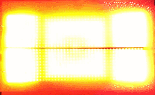
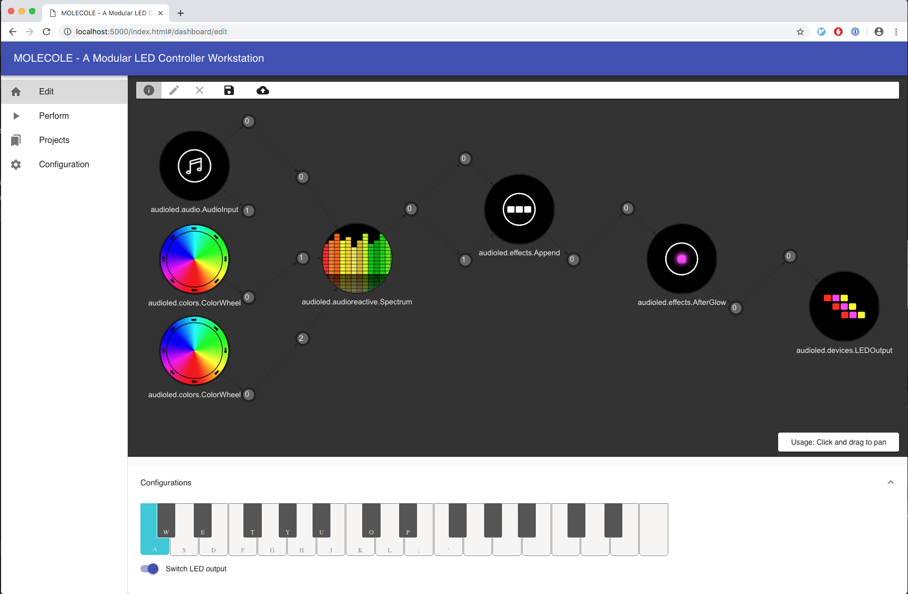

# MOLECOLE - A Modular LED Controller Workstation

[](https://travis-ci.org/segfault16/audio-reactive-led-strip)

MOLECOLE is a real-time LED controller for the Raspberry Pi. 

It comes with a bunch of modules to generate and manipulate pixels, so you can configure your own music visualizer or ambient lighting for LED strips.


It even supports LED panels!



For runtime configuration there is a REST webserver with a web UI.




The works in this project is based on [https://github.com/scottlawsonbc/audio-reactive-led-strip](https://github.com/scottlawsonbc/audio-reactive-led-strip).


# Getting started (local machine)

## Python Dependencies
MOLECOLE requires at least Python 3.5.

A few Python dependencies must also be installed, e.g.
- Numpy
- Scipy (for digital signal processing)
- PyAudio (for recording audio with microphone)

On Windows machines, the use of [Anaconda](https://www.continuum.io/downloads) is **highly recommended**. Anaconda simplifies the installation of Python dependencies, which is sometimes difficult on Windows.

### Installing dependencies with Anaconda
Create a [conda virtual environment](http://conda.pydata.org/docs/using/envs.html) (this step is optional but recommended)
```bash
conda create --name visualization-env python=3.5
source activate visualization-env
```
On Mac, you need to install portaudio
```bash
brew install portaudio
```

Install dependencies using pip and the conda package manager
```bash
conda install numpy scipy

pip install pyaudio matplotlib jsonpickle flask mido python-rtmidi apscheduler
```

## OpenPixelControl Visualization Server

For running MOLECOLE without a RaspberryPi we need to somehow visualize the RGB data.
For this you can use [openpixelcontrol](https://github.com/zestyping/openpixelcontrol).

- Clone the project parallel to this repository
- Follow the instructions to compile the project
- Use the compiled binary `gl_server` to start an OpenGL visualization server on localhost port 7890 to visualize the RGB data

```bash
# A LED Strip with 300 pixels
../openpixelcontrol/bin/gl_server -l layouts/demo_layout.json
# or a LED Panel with 44x22 pixels
../openpixelcontrol/bin/gl_server -l layouts/wall_44x22.json
```

## Running MOLECOLE

```bash
# Run with LED Strip configuration
python server.py -N 300
# Run with LED Panel configuration
python server.py -N 968 -R 22
# For more information:
python server.py -h
```

You should now see some RGB data in OpenPixelControl and should be able to access the MOLECOLE UI on https://localhost:5000.

Start playing around or upload some sample configurations from [configurations](./configurations).


# Getting started (Raspberry Pi)

See [Running on RaspberryPi](./docs/pi_setup.md).


